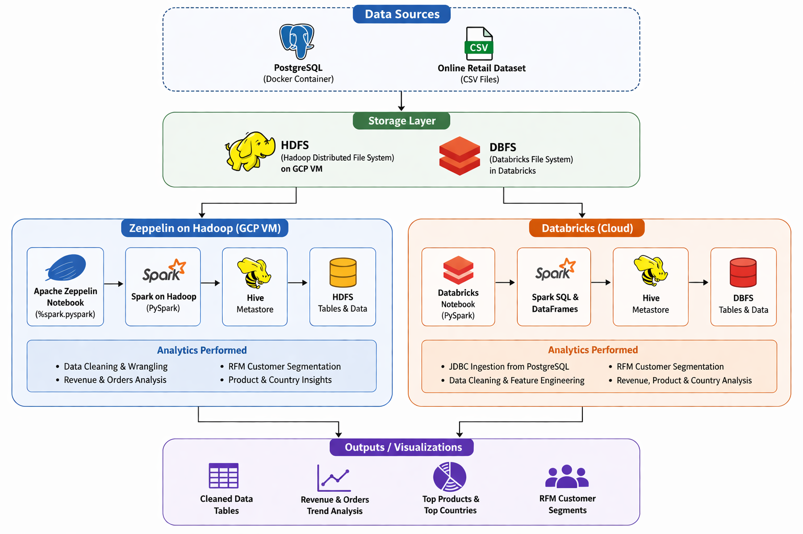

# Introduction
This project demonstrates a complete **retail data analytics pipeline** implemented across both **Databricks** and **Apache Zeppelin** using **PySpark, Hadoop, PostgreSQL, and Hive**.

The goal of this project is to help project team members understand the **design, architecture, feature engineering, and business analytics workflow** by reviewing the README and notebooks.

The solution focuses on scalable big data analytics using:
- **PostgreSQL Docker** as transactional data source
- **CSV-based retail dataset ingestion**
- **PySpark ETL and wrangling**
- **RFM customer segmentation**
- **Revenue and country-level analysis**
- **Dual-platform implementation**
  - Databricks (cloud analytics)
  - Zeppelin + Hadoop on GCP VM

---

# Architecture Overview
The project implements the same retail analytics workflow across **two big data environments**:

- **Databricks on Azure**
  - JDBC ingestion from PostgreSQL
  - DBFS managed storage
  - PySpark transformations
  - Hive Metastore
  - notebook visualizations

- **Zeppelin on GCP VM**
  - JDBC ingestion from PostgreSQL Docker
  - HDFS storage
  - Spark on Hadoop
  - Hive Metastore
  - `z.show()` visualizations

### Architecture Diagram

---

# Databricks and Hadoop Implementation

## Dataset and Analytics Work
The project uses the **Online Retail dataset**, which contains:
- Invoice number
- Product description
- Quantity
- Unit price
- Customer ID
- Country
- Invoice timestamp

### Analytics Performed
- JDBC ingestion from PostgreSQL
- CSV ingestion into DBFS
- Data cleaning and null handling
- Revenue feature engineering
- Product and country trend analysis
- RFM customer segmentation
- Spark SQL + DataFrame transformations
- Notebook visualizations

Notebook:  
[Databricks Retail Analytics Notebook](./notebook/retail_data_analytics_wrangling_pyspark.ipynb)

---

# Zeppelin and Hadoop Implementation

## Dataset and Analytics Work
The Zeppelin implementation reproduces the same business analytics pipeline using:
- `%spark.pyspark`
- Spark SQL
- Hadoop Distributed File System (HDFS)
- Hive tables
- Zeppelin notebook visualizations using `z.show()`

### Analytics Performed
- JDBC ingestion from PostgreSQL Docker
- CSV ingestion into HDFS
- PySpark ETL
- Revenue analysis
- Country sales analysis
- Product performance analysis
- RFM customer segmentation
- Zeppelin charting

Notebook:  
[Zeppelin Retail Analytics Notebook](./notebook/Spark_Analytics_Notebook.zpln)

---

# ETL Pipeline (Medallion Architecture)

## Overview
The ETL pipeline is implemented using Databricks notebooks following the Medallion Architecture:

Bronze ? Silver ? Gold

Each layer is modular and independently executable.

---

## Pipeline Design

### Bronze Layer
- Raw ingestion from:
  - CSV files (transactions, users, cards)
  - JSON files (`mcc_codes`, `train_fraud_labels`)
- Minimal transformations
- Append-only design

---

### Silver Layer
- Data cleaning and normalization  
- Schema enforcement  
- Join enrichment:
  - Transactions + MCC codes  
  - Transactions + Fraud labels  
- Derived columns:
  - Time-based features (day, week, hour)  
  - Transaction-level features  

---

### Gold Layer
- Aggregated business-level tables  
- Optimized for analytics and dashboarding  

---

## Pipeline Requirements
- Separate notebooks for each layer:
  - `bronze_pipeline`
  - `silver_pipeline`
  - `gold_pipeline`
- Running each notebook refreshes its respective tables
- Use JSON datasets (`mcc_codes`, `train_fraud_labels`) to enhance the silver layer
- Create tables for all core entities (users, cards, transactions, fraud, MCC)

---

## Business Questions (Gold Layer)
- Which day(s) of the week sees the highest number of fraudulent transactions?
- What is the trend of the fraud rate over time?
- Which users have the largest number of fraudulent transactions?
- Are there users with sudden spikes in transaction activity?
- Which merchant categories have the highest fraud rate?
- Are there merchants with unusually high fraud volume?
- How does fraud vary by time of day?
- What?s the average transaction amount for fraud vs non-fraud?
- What are total monetary losses due to fraud per day?
- How many unique users commit fraud weekly?
- Are there seasonal or monthly fraud spikes?
- How does user behavior change before vs after fraud events?
- Are high-value transactions more prone to fraud?

---

# Dashboard
- Built using Gold tables as the source
- Includes filters and parameter widgets
- Must be published for pipeline-based refresh
- Used for fraud trends, user behavior, and merchant insights

---

# Delta Live Tables (DLT Pipeline)

## Overview
A Delta Live Tables (DLT) pipeline is implemented for incremental and streaming data processing.

---

## Data Source
- Stock data ingested from Alpha Vantage API (multiple symbols)

---

## Pipeline Layers

### Bronze
- Raw ingestion from API
- Latest stock prices (quote endpoint)
- Company information

---

### Silver
- Cleaned and enriched datasets
- Standardized schema and formats

---

### Gold
- Aggregated analytics:
  - Price trend analysis (7, 30, 90 days)
  - Percentage change over time
  - Volume trend analysis

---

## Design Considerations
- Streaming tables vs materialized views  
- Slowly Changing Dimensions (SCD) handling  
- Triggered vs continuous pipeline execution  
- Failure handling and retries  

---

# Orchestration

## Workflow
- Data ingestion  
- Pipeline execution (Bronze ? Silver ? Gold)  
- Dashboard refresh  

## Scheduling
- Daily scheduled jobs using Databricks Workflows / Jobs

---

# Future Improvement
1. **Delta Lake Integration**
   - Upgrade Databricks tables to Delta Lake for ACID transactions and time travel.

2. **Real-Time Streaming**
   - Extend the batch pipeline into real-time analytics using Structured Streaming.

3. **Power BI / Dashboarding**
   - Publish RFM and revenue insights into executive dashboards.

4. **Machine Learning Segmentation**
   - Replace static RFM scoring with clustering models.

5. **CI/CD Data Pipelines**
   - Automate notebook execution and deployment using GitHub Actions and Databricks Jobs.

